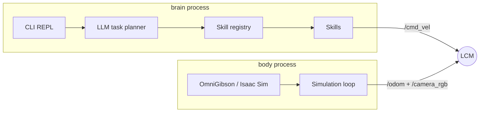

# RoboMind

[](https://github.com/WallyHao/robo-mind/actions/workflows/ci.yml)
[](LICENSE)
[](pyproject.toml)
[](https://github.com/astral-sh/ruff)
[](https://mypy-lang.org/)
[](tests)

**Embodied robot control with a dual-process body/brain architecture over LCM.**

RoboMind drives a simulated robot from natural language. A language model
decomposes an instruction into atomic skill tasks, and a skill layer executes
them against a physics simulation. The two halves run as **separate OS
processes** that talk only through LCM channels, so the planner and the
simulation can be developed, replaced and restarted independently.

## Highlights

- **Dual-process design** — a `brain` process (LLM planning + REPL) and a
  `body` process (OmniGibson / Isaac Sim) communicate exclusively over LCM.
- **Natural-language task planning** — DeepSeek decomposes an instruction into
  a JSON list of skill calls with parameters.
- **VLM perception** — Qwen / DeepSeek / OpenAI vision models locate objects in
  the camera frame for visual closed-loop approach.
- **Six composable skills** — navigation, turning, stopping, position query,
  object lookup and visual navigation.
- **Typed and validated** — `mypy --strict` on the source tree and pydantic
  models for every configuration file.
- **Offline test suite** — the planner, VLM parsing, skills, LCM bridge and
  configuration are tested without a simulator or a GPU.

## Architecture



- `brain.py` subscribes to `/odom` and `/camera_rgb` and publishes `/cmd_vel`.
- `body.py` subscribes to `/cmd_vel` and publishes `/odom` and `/camera_rgb`.
- `LcmBridge` wraps `lcm.LCM()` with a background handler thread and
  thread-safe accessors, and is shared by both processes.

## Requirements

| Requirement | Notes |
| --- | --- |
| NVIDIA GPU + CUDA 12.x | Required for Isaac Sim / OmniGibson |
| Isaac Sim | Requires an [NVIDIA Omniverse](https://www.nvidia.com/en-us/omniverse/) license |
| Python 3.11 | Isaac Sim's `carb._carb` extension needs 3.11; the library itself runs on 3.10+ |
| dimOS | Provides the LCM message types; installed externally |

## Install

```bash
git clone https://github.com/WallyHao/robo-mind.git
cd robomind

python -m venv .venv
. .venv/bin/activate
pip install -e ".[dev]"
```

The simulation stack is installed separately and is **not** included here:

**dimOS** — LCM messaging, navigation and perception

```bash
git clone https://github.com/dimensionalOS/dimos.git
cd dimos
pip install -e .
cd ..
```

**BEHAVIOR-1K + OmniGibson** — simulation environment

```bash
git clone https://github.com/StanfordVL/BEHAVIOR-1K.git
cd BEHAVIOR-1K
git submodule update --init --recursive
pip install -e OmniGibson/
cd ..
```

Then copy the environment template and fill in your values:

```bash
cp .env.example .env
```

```env
DEEPSEEK_API_KEY=sk-xxxxxxxx          # DeepSeek API key (LLM)
ALIBABA_API_KEY=sk-xxxxxxxx           # Alibaba Bailian API key (VLM)
DIMOS_SITE_PATH=/path/to/dimos/site-packages
BEHAVIOR_DIR=/path/to/BEHAVIOR-1K
```

## Run

```bash
make run
```

```
RoboMind> go to the door
[LLM] parsed 2 tasks:
  [1] navigate_to_object -- approach the door
  [2] stop -- halt
[OK] arrived near 'door'
[DONE] all tasks completed

RoboMind> /help      # show available commands
RoboMind> /skills    # list available skills
RoboMind> /dry <cmd> # preview task plan without executing
RoboMind> /pos       # query current position
RoboMind> exit       # quit
```

## Skills

| Skill | Description |
| --- | --- |
| `navigate` | Timed open-loop navigation |
| `stop` | Immediate halt |
| `turn` | Rotate in place |
| `get_position` | Query current coordinates |
| `look` | VLM object detection in the camera frame |
| `navigate_to_object` | Visual closed-loop approach |

## Configuration

| File | Purpose |
| --- | --- |
| `configs/body.yaml` | OmniGibson scene / robot / timing / LCM settings |
| `configs/brain.yaml` | LLM and VLM backend selection, LCM channels, logging |
| `configs/prompts/task_planner.txt` | LLM system prompt for task decomposition |
| `.env` | API keys and machine-specific paths |

All YAML files are validated with pydantic at load time.

## Development

```bash
make lint        # ruff check + format check
make typecheck   # mypy --strict on src/
make test        # pytest with coverage
make run         # launch body + brain
make clean       # remove caches and logs
```

The tests are offline: they fake LCM and the LLM/VLM APIs, so no GPU,
simulator or API key is needed. See [`CONTRIBUTING.md`](CONTRIBUTING.md).

## License

Released under the [MIT License](LICENSE).
